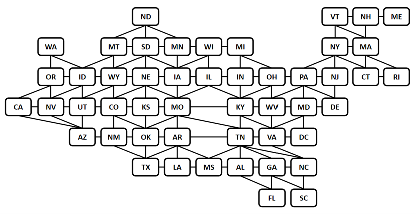
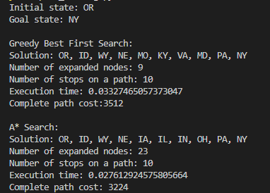
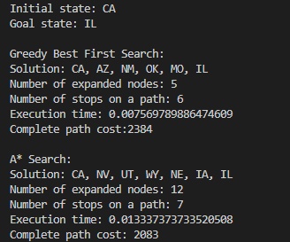

# Overview
Consider the graph presented below. Each node represents a single state (or the District of Columbia (DC)). If two states are neighbors, there is an edge between them.  
  
Assume that edge weights represent driving distances between state capitals. The task is using greedy best-first search and A* to find and print the path from the initial state to the goal state. The codes should also record the number of expanded nodes, the number of stops on a path, execution time, and the complete path cost. The label names of the initial states and goal states follow the abbreviation of the state shown in the image above. For example, WA, CA, IL, SC, etc.

# Documents
There are two Excel documents: `driving.csv` and `straightline.csv`. The `driving.csv` records the actual distances between two states. If the data is -1, that means there is no path between two states. The `straightline.csv` file contains the straight-line distances between two states.

# How to Use
Following the basic command below in the terminal:
'''
python path_finding.py GOAL INIT
'''

or directly type one of the samples in the terminal:
'''
python path_finding.py NY OR
'''

# Results

